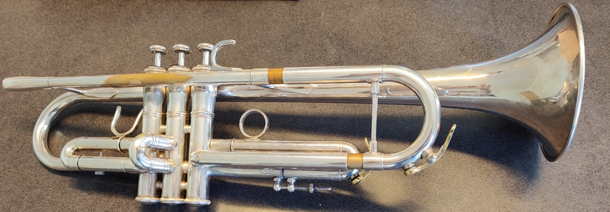
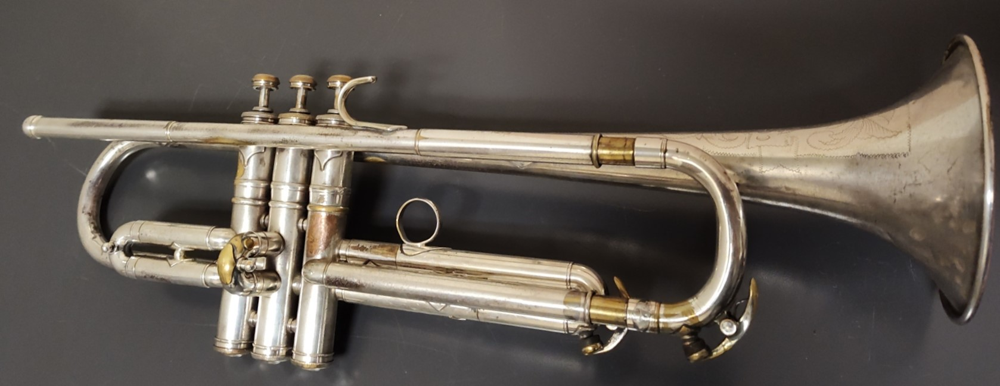
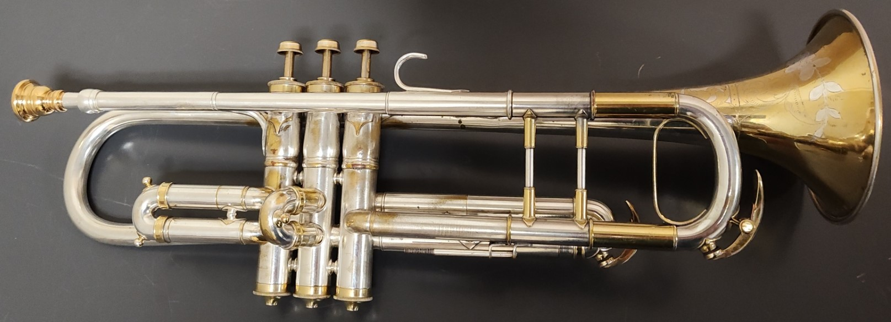
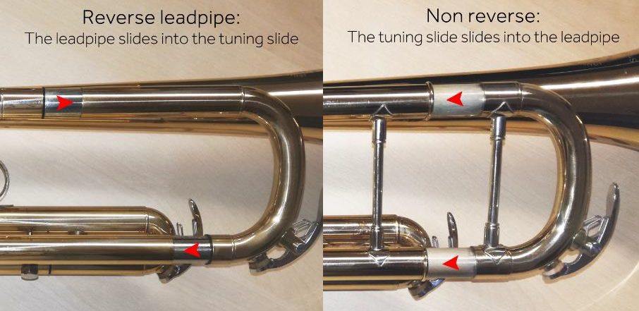
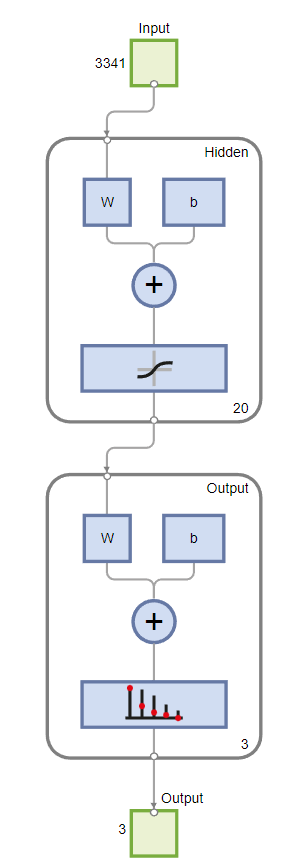
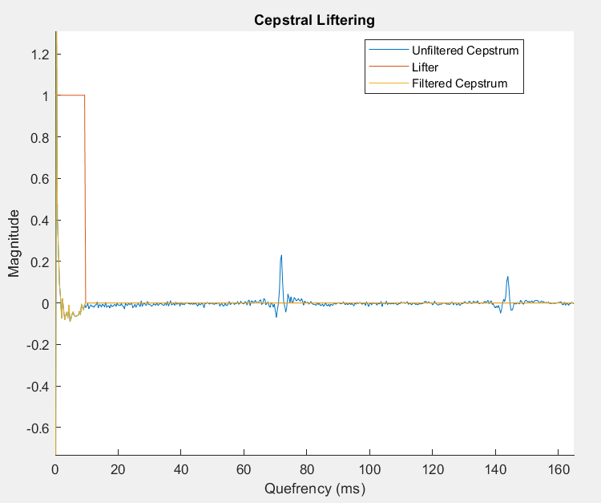

# InstrumentComparison

For code documentation, see [here](CodeDocumentation.md).

## Introduction
The crux of this project is to see if design choices in the manufacture of different models of the same instrument result in objective differences in the sound of the instrument. There is a lively discussion online about the differences in sound quality and playability of horns from different manufacturers, models and even years within the same production line! My original opinion is that once a trumpet is at a certain level of quality, it becomes harder to distinguish any of them from each other in the hands of the same player. Does switching out the main tuning slide from a D-shaped one to a C-shaped one make a difference? I would say no, and that the people saying they can hear a difference are preconditioning themselves to hear an improvement to justify their purchase. I aim to answer questions like these objectively with computational assistance.

## Trumpets used here

I use three trumpets in this work, Jupiter 1604, Conn 5B New York Symphony (NYS) and Conn Wonderphone. These are all professional grade instruments, but there are noticeable design differences between all three. The Jupiter has a D-shaped tuning slide, and a reversed leadpipe, which are meant to more smoothly let the air through the instrument. The Conn 5B NYS dates from the 1920’s and shows its age in the form of slightly damaged valve casings. This makes valve action less smooth, but the most notable design difference is the exclusion of the brace between the top and bottom of the tuning slide, which is supposed to allow more free vibration of the instrument. The Wonderphone is about 20 years older than the NYS horn, and has a receiver that is not the standard size used for trumpets. It also has an insert between the tuning slide and the horn body that is used to switch between High Pitch and Low Pitch tuning systems. This adds more resistance to the instrument and makes it harder to play loudly.

## Data

Single recordings of every note in my playable range were used for each instrument. This had significant variation particularly between the Wonderphone and the other two. The tone quality was variable, especially in the high register.

### Preprocessing

The quality of the data used to train a neural network is as important as the training algorithm itself. The audio samples I collected were 3 seconds long, but sampling at 44100 Hz means 13,2300 samples per recording. This is overkill and would likely give bad results or be hard to optimize at all. In the audio processing field, a common way to capture how sound changes over the course of a recording with minimal data points are the Mel Frequency Cepstral Coefficients (MFCCs). The Mel frequency scale is designed to sound linear to humans, which is not achieved by the Hz scale. The difference between C2 (65 Hz) and C4 (262 Hz) sounds much larger than G6 (1568 Hz) and A6 (1760 Hz), even though both are separated by about 200 Hz. This is because human perception of pitch scale logarithmically. We can convert between Hz and mels with

$m = 2595 * log_{10}(1 + f/700)$, where m is the Mel frequency with units of mel and f is the frequency in Hz. 

The Mel Frequency Cepstrum is obtained by

$𝐶=𝐷𝐶𝑇(log{10}(𝑚(2|ℱ(𝑥(𝑡))|)))$,

where $x(t)$ is the original waveform, $ℱ$ is the Fourier transformation, $m$ is the conversion to the Mel spectrum, and $DCT$ is the discrete cosine transformation. The log operation creates a log-spectrum, which plots frequency by loudness. The final transformation creates a spectrum of a spectrum, which is known as a sepstrum. In this case, it is plotted in the quefrency domain, which uses units of ms.
To get the MFCCs, the original recording is divided into several frames with a short duration. The frames typically overlap. After the Fourier transformation is taken, a set of k overlapping triangular filters is applied. These are constructed with peaks spaced equally on the mel spectrum, which causes the bases to be wider in the Hz frequency domain. Each filter is applied individually, and the weighted average of each filtered spectrum is computed on each band after filtering, i.e., k averages are obtained. These are plotted as peaks on the spectrum, which is then converted to the cepstrum as shown above. The MFCCs are the peak heights of the cepstrum obtained for each window of the recording. In this work, I used 13 coefficients and 257 samples per recording. I reshaped the MFCC matrix to a 3341-vector to use as input data for the neural network.

## Results
The neural network I used is from the Deep Learning Toolbox in MATLAB. In addition to the input layer, I used a hidden layer with 20 nodes. The number of output nodes is dependent on the number of trumpets to be classified. In this case there are 3. These nodes give binary outputs, and the overall output vector (i.e., (100),(010), or (001)) is interpreted as the NN’s classification. 70% of the data was reserved for training data and the remaining data was evenly split for validation and test data. This setup works shockingly well, with a 100% success rate.

 

## Further Investigation

I tried to understand what pattern the computer could possibly find that supports this level of accuracy. I tried to visualize the differences in the sound for each horn using similar preprocessing techniques used to obtain MFCCs. First, I took a Fourier Transform of the waveform, then took the log, and applied a low-pass lifter (cepstral analogue of filter in the FT spectrum) with a cutoff quefrency of about 15 ms. This highlights an important use of cepstral liftering: signals can be separated by subtraction in the quefrency domain. This is used by speech recognition software to isolate the formants of people’s speech, which is the characteristic part of their speech. In this case, the resonance properties of the trumpet were isolated from the buzzing lips that produced the sound.

The resulting curve is referred to as the envelope. I did not slice the recordings into small windows as the MFCC procedure does, which would lead to better consistency, but the plots for most notes recorded still have a similar shape, which highlights their connection to an intrinsic property of the horn, since samples were collected over three octaves. When the average spectral envelopes for each horn are plotted on the Mel frequency scale together, the Conn Wonderphone has a curve much lower than the Jupiter trumpet I primarily use, which indicates it is generally quieter across all frequencies. This can be rationalized by the extra resistance incurred by the inserts in the tuning slide, though there may be other design differences, like bore size that contribute to this. I find it much harder to distinguish between the Conn 5B New York Symphony and the Jupiter trumpet while playing besides the different valve resistances, which is supported by the similarity of their envelopes. Given the computer is much better than I at finding patterns, it is not surprising that the computer can distinguish the two.

## Works Cited
Lyons, J. (n.d.). Practical cryptography. Practical Cryptography. Retrieved May 7, 2023, from http://practicalcryptography.com/miscellaneous/machine-learning/guide-mel-frequency-cepstral-coefficients-mfccs/

Nielsen, M. A. (2015). Neural networks and deep learning. http://neuralnetworksanddeeplearning.com
